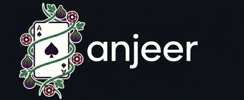
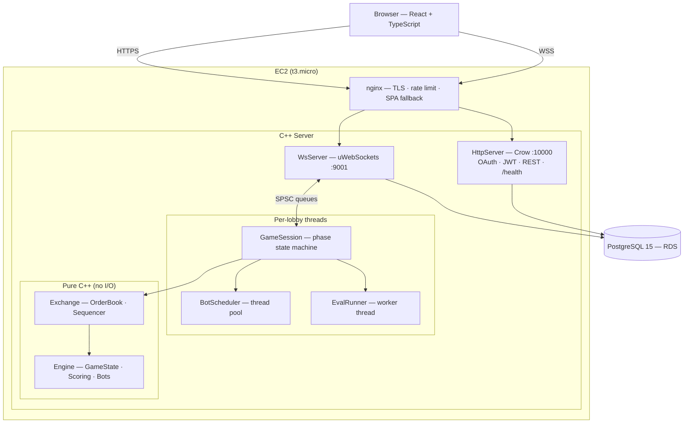
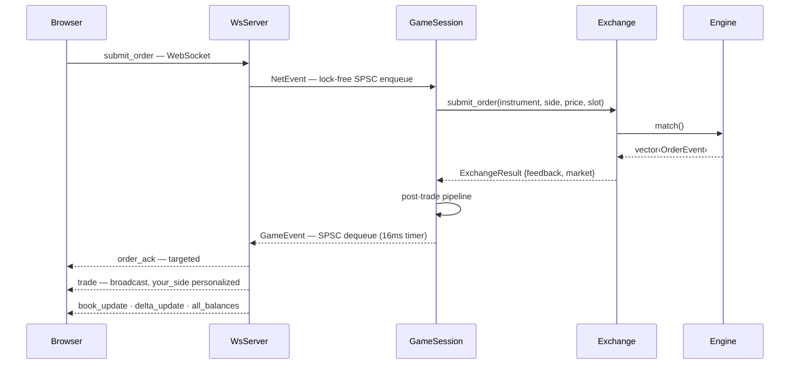

<p align="center">
  
</p>

<p align="center">
  
  
  
  
  
  
</p>

<p align="center">
  <strong>Live:</strong> <a href="https://anjeer.duckdns.org">anjeer.duckdns.org</a> &nbsp;·&nbsp; <strong>Demo:</strong> coming soon
</p>

---

  A real-time multiplayer card-trading game with a C++ matching engine, multithreaded server, Bayesian bot AI, and a React frontend deployed on AWS.

## Inspired by Figgie

Anjeer is inspired by [Figgie](https://figgie.com), a card game designed by Jane Street as a simplified model of financial markets. In Figgie, four players trade cards in real time trying to accumulate the hidden goal suit before the round ends. See the [official rules](https://figgie.com/how-to-play).

**What anjeer adds on top:**

- **Broader Game Mechanics** - 3 different game modes, giving you MBP-1, MBP-5 and MBO views of the orderbook, with real-time bid/ask depth, optional persistence, trade feed, delta tracking and real time back-of-the-napkin math for the game.
- **Eval framework** — real-time analysis running on a dedicated thread: Bayesian posteriors per player, accumulation signals, and execution guidance, essentially a subset of the signal you want to learn to do in your head over time.
- **API mode & scripted players** — in case you enjoy coding, players can connect self developed algorithms/strategies for the game over the same WebSocket protocol the browser uses; a Python CLI handles lobby management and script launch, so you can focus on just policy.
- **And more?** - the project is built to naturally extend to include leaderboards, ranked gameplay, and machine learning integrations as well as to scale up across multiple nodes of deployment to handle more traffic.

---

## System Architecture



## Order Lifecycle



---

## What Was Built

| Area | What's here |
|---|---|
| [**Engine & Exchange**](engine/README.md) | Basic limit order book, dual-return event API, pure C++ game logic and scoring |
| [**Server & Backend**](server/README.md) | Four-axis lock-free threading model, OAuth + JWT auth, WebSocket + REST servers, Bayesian eval framework |
| [**Frontend**](frontend/README.md) | React + TypeScript, real-time WebSocket state, landing page, three market data view modes |
| [**CLI**](cli/README.md) | Python CLI for scripted/algorithmic players; full wire protocol access |

---

## Quick Start

```bash
git clone git@github.com:devajya/anjeer.git && cd anjeer
npm install --prefix frontend
cp config/default.example.json config/default.json
# fill in: db connection string, jwt secret, OAuth credentials
make dev
```

Open [http://localhost:5173](http://localhost:5173). See the sub-READMEs above for deeper setup and configuration.

---

## Repo Layout

```
anjeer/
├── engine/        # Pure C++ game logic and bot strategies
├── exchange/      # OrderBook, ExchangeSession, Sequencer
├── server/        # WsServer, HttpServer, GameSession, auth, eval
├── frontend/      # React + TypeScript + Vite
├── cli/           # Python CLI package
├── db/migrations/ # Versioned SQL (auto-applied on server start)
├── config/        # default.example.json, prod.json
├── nginx/         # Reverse proxy config
├── scripts/       # systemd unit, EC2 setup, CloudWatch config
└── .github/       # CI + CD workflows
```

---

## Known Limitations

- **Lobby list is REST-only** — no live updates; the lobby browser requires a manual refresh to reflect new lobbies or status changes.
- **Spectate feed is always MBP-1** — the spectator view shows simple best-bid/ask regardless of the lobby's game mode.
- **Reconnect token unreliable in round 1** — tokens issued before the game-loop thread finishes initializing slot state may not work.
- **No multi-node support** — `LocalEventBus` is in-process only; `RedisEventBus` exists as a stub for when horizontal scaling is needed.

## Acknowledgements

- **[Figgie](https://figgie.com)** by Jane Street — the original game this project is based on. See the [official rules](https://figgie.com/how-to-play), and I'm happy to take this down in case I'm accidentally violating terms of use.
- **[Claude Code](https://claude.ai/code)** This project was also an attempt to build a somewhat complete project primarily driven by AI. I planned out I'd say about 75% of the project in vertical slices and features with definitions, user stories objectives and acceptance criteria. I then resolved ambiguities consistently at a project and concerns level till I felt enough context existed for a task by task breakdown. Then I would implement tasks one by one using claude, changing direction and fixing bad practices when I spotted them. I broadly directed architecture and design decisions, reviewed all output, and manually authored the parts that required the most care — threading logic, bot math, and visual design. Claude Code handled the bulk of implementation.
